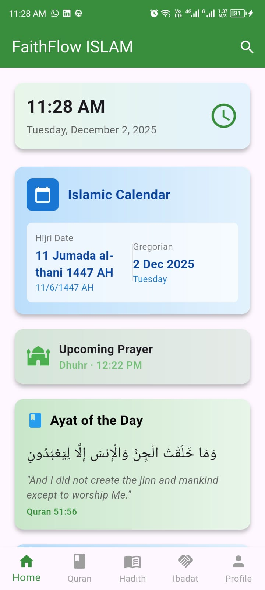
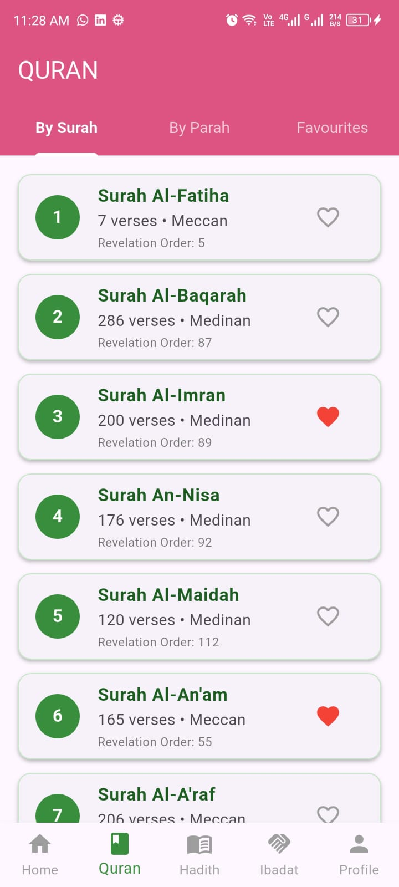
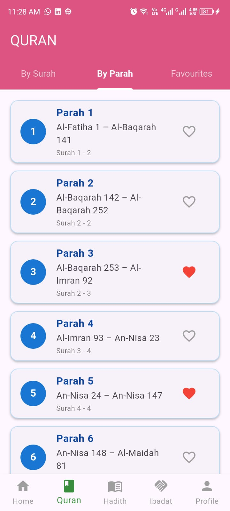
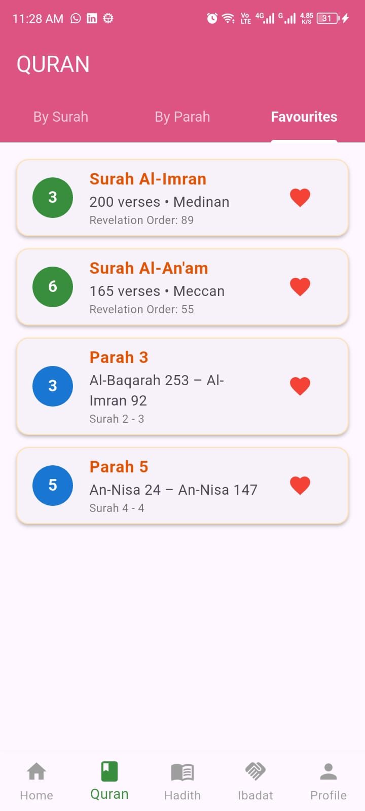
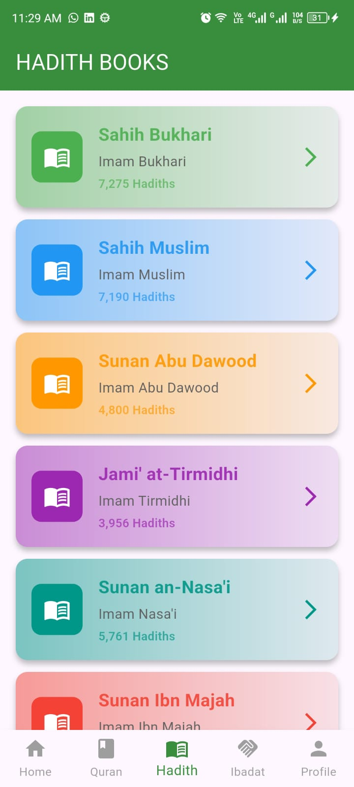
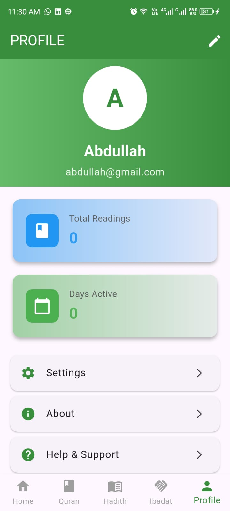
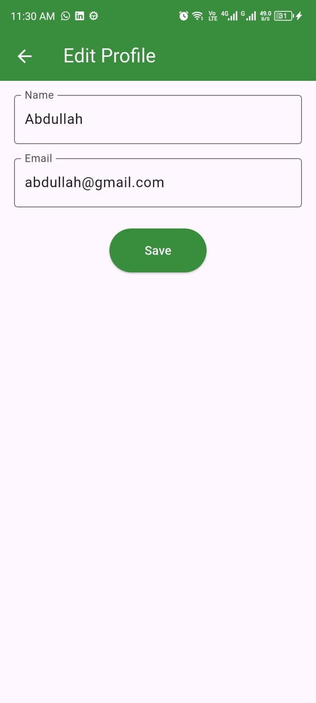
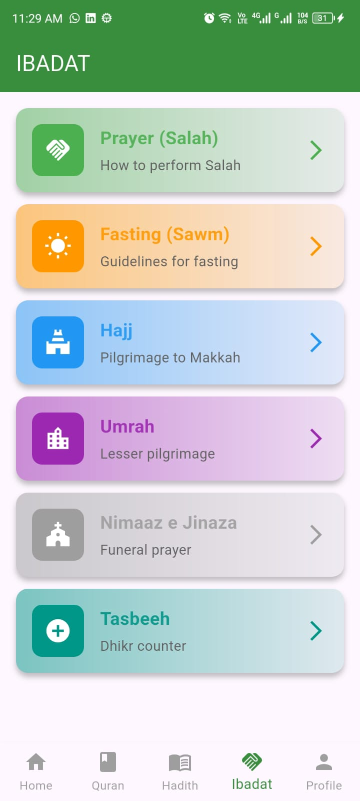

# FaithFlow_Islam

A full-stack Islamic mobile app built with Flutter, featuring both frontend and basic backend functionality. Designed as a personal self-learning project.

## Features

### Frontend
- Splash screen with gradient background
- Home dashboard with daily Ayat & Hadith
- Quran screen with full details (verses, revelation order, type, total verses)
- Separate Quran sections (Surah, Parah, Favourite)
- Hadith from Sihah-e-Sitta
- Ibadat guides & Tasbeeh counter
- Profile screen & Edit screen
- Beautiful UI with cards, search bar, and bottom navigation

### Backend / Functional
- **Upcoming prayer times** dynamically calculated
- **Tasbeeh counter** (increment, reset)
- **Islamic calendar** with Islamic date/month/year
- **Gregorian calendar** with dates and time
- **Favourite Ayah/Surah** shows separate section

## Tech Stack
- Flutter & Dart
- Local database (SQLite or JSON)
- GetX state management

## Screenshots

### Home Screen (Prayer Times & Calender) 

### Tasbeeh Counter

### Quran Details

### Hadith Details 

### Profile

### Edit Profile 

### Ibadat

## Installation
1. Clone the repo
2. `flutter pub get`
3. Run on emulator or device

## Future Improvements
- Audio recitation for Quran
- Integrate APIs for Quran and Hadith (all books)
- Push notifications for prayer times
- Dark mode & theme switching
- Bookmarking & favorites
